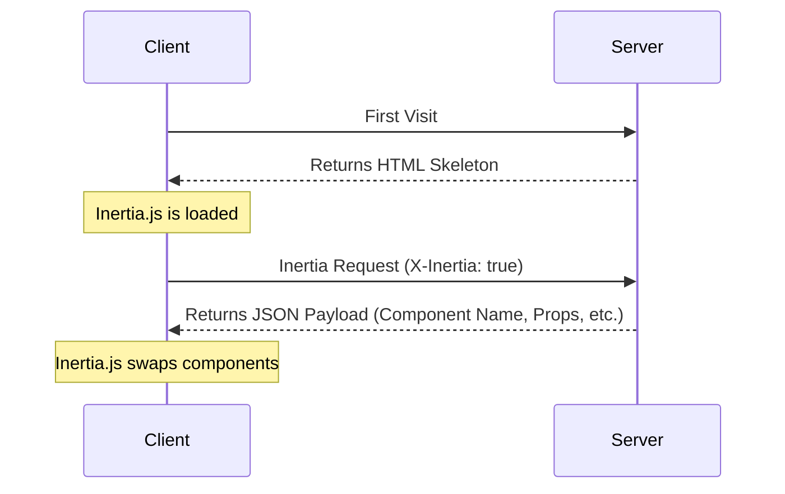

This page contains a detailed specification of the Inertia protocol. Be sure to read the [how it works](/v2/core-concepts/how-it-works) page first for a high-level overview.

## HTML Responses

The very first request to an Inertia app is just a regular, full-page browser request, with no special Inertia headers or data. For these requests, the server returns a full HTML document.

This HTML response includes the site assets (CSS, JavaScript) as well as a root `<div>` in the page's body. The root `<div>` serves as a mounting point for the client-side app, and includes a `data-page` attribute with a JSON encoded [page object](#the-page-object) for the initial page. Inertia uses this information to boot your client-side framework and display the initial page component.

```http
REQUEST
GET: https://example.com/events/80
Accept: text/html, application/xhtml+xml

RESPONSE
HTTP/1.1 200 OK
Content-Type: text/html; charset=utf-8

<html>
    <head>
        <title>My app</title>
        <link href="/css/app.css" rel="stylesheet">
        <script src="/js/app.js" defer></script>
    </head>
    <body>
        <div id="app" data-page='{"component":"Event","props":{"errors":{},"event":{"id":80,"title":"Birthday party","start_date":"2019-06-02","description":"Come out and celebrate Jonathan&apos;s 36th birthday party!"}},"url":"/events/80","version":"c32b8e4965f418ad16eaebba1d4e960f"}'></div>
    </body>
</html>
```

While the initial response is HTML, Inertia does not server-side render the JavaScript page components. For information on server-side rendering, see the [SSR documentation](/v2/advanced/server-side-rendering).

## Inertia Responses

Once the Inertia app has been booted, all subsequent requests to the site are made via XHR with a `X-Inertia` header set to `true`. This header indicates that the request is being made by Inertia and isn't a standard full-page visit.

When the server detects the `X-Inertia` header, instead of responding with a full HTML document, it returns a JSON response with an encoded [page object](#the-page-object).

```http
REQUEST
GET: https://example.com/events/80
Accept: text/html, application/xhtml+xml
X-Requested-With: XMLHttpRequest
X-Inertia: true
X-Inertia-Version: 6b16b94d7c51cbe5b1fa42aac98241d5

RESPONSE
HTTP/1.1 200 OK
Content-Type: application/json
Vary: X-Inertia
X-Inertia: true

{
    "component": "Event",
    "props": {
        "errors": {},
        "event": {
            "id": 80,
            "title": "Birthday party",
            "start_date": "2019-06-02",
            "description": "Come out and celebrate Jonathan's 36th birthday party!"
        }
    },
    "url": "/events/80",
    "version": "6b16b94d7c51cbe5b1fa42aac98241d5",
    "encryptHistory": true,
    "clearHistory": false
}
```

## Request Lifecycle Diagram

The diagram below illustrates the request lifecycle within an Inertia application. The initial visit generates a standard request to the server, which returns an HTML application skeleton containing a root element with hydrated data. For subsequent user interactions and navigation, Inertia sends XHR requests that return JSON data. Inertia uses this response to dynamically hydrate and swap the page component without a full page reload.



## Request Headers

The following headers are automatically sent by Inertia when making requests. You don't need to set these manually, they're handled by the Inertia client-side adapter.

<ParamField header="X-Inertia" type="boolean">
  Set to `true` to indicate this is an Inertia request.
</ParamField>

<ParamField header="X-Requested-With" type="string">
  Set to `XMLHttpRequest` on all Inertia requests.
</ParamField>

<ParamField header="Accept" type="string">
  Set to `text/html, application/xhtml+xml` to indicate acceptable response types.
</ParamField>

<ParamField header="X-Inertia-Version" type="string">
  The current asset version to check for asset mismatches.
</ParamField>

<ParamField header="Purpose" type="string">
  Set to `prefetch` when making [prefetch](/v2/data-props/prefetching) requests.
</ParamField>

<ParamField header="X-Inertia-Partial-Component" type="string">
  The component name for [partial reloads](/v2/data-props/partial-reloads).
</ParamField>

<ParamField header="X-Inertia-Partial-Data" type="string">
  Comma-separated list of props to include in partial reloads.
</ParamField>

<ParamField header="X-Inertia-Partial-Except" type="string">
  Comma-separated list of props to exclude from partial reloads.
</ParamField>

<ParamField header="X-Inertia-Reset" type="string">
  Comma-separated list of props to reset on navigation.
</ParamField>

<ParamField header="Cache-Control" type="string">
  Set to `no-cache` for reload requests to prevent serving stale content.
</ParamField>

<ParamField header="X-Inertia-Error-Bag" type="string">
  Specifies which error bag to use for [validation errors](/v2/the-basics/validation).
</ParamField>

<ParamField header="X-Inertia-Infinite-Scroll-Merge-Intent" type="string">
  Indicates whether the requested data should be appended or prepended when using [Infinite scroll](/v2/data-props/infinite-scroll).
</ParamField>

<ParamField header="X-Inertia-Except-Once-Props" type="string">
  Comma-separated list of non-expired [once prop](/v2/data-props/once-props) keys already loaded on the client. The server will skip resolving these props unless explicitly requested via a partial reload or force refreshed server-side.
</ParamField>

The following headers are used for [Precognition](/v2/the-basics/forms#precognition) validation requests.

<ParamField header="Precognition" type="boolean">
  Set to `true` to indicate this is a Precognition validation request.
</ParamField>

<ParamField header="Precognition-Validate-Only" type="string">
  Comma-separated list of field names to validate.
</ParamField>

## Response Headers

The following headers should be sent by your server-side adapter in Inertia responses. If you're using an official server-side adapter, these are handled automatically.

<ParamField header="X-Inertia" type="boolean">
  Set to `true` to indicate this is an Inertia response.
</ParamField>

<ParamField header="X-Inertia-Location" type="string">
  Used for external redirects when a `409 Conflict` response is returned due to asset version mismatches.
</ParamField>

<ParamField header="Vary" type="string">
  Set to `X-Inertia` to help browsers correctly differentiate between HTML and JSON responses.
</ParamField>

The following headers are used for [Precognition](/v2/the-basics/forms#precognition) validation responses.

<ParamField header="Precognition" type="string">
  Set to `true` to indicate this is a Precognition validation response.
</ParamField>

<ParamField header="Precognition-Success" type="string">
  Set to `true` when validation passes with no errors, combined with a `204 No Content` status code.
</ParamField>

<ParamField header="Vary" type="string">
  Set to `Precognition` on all responses when the Precognition middleware is applied.
</ParamField>

## The Page Object

Inertia shares data between the server and client via a page object. This object includes the necessary information required to render the page component, update the browser's history state, and track the site's asset version. The page object can include the following properties:

<ParamField body="component" type="string">
  The name of the JavaScript page component.
</ParamField>

<ParamField body="props" type="object">
  The page props. Contains all of the page data along with an `errors` object (defaults to `{}` if there are no errors).
</ParamField>

<ParamField body="url" type="string">
  The page URL.
</ParamField>

<ParamField body="version" type="string|number">
  The current [asset version](/v2/advanced/asset-versioning).
</ParamField>

<ParamField body="encryptHistory" type="boolean">
  Whether or not to [encrypt the current page's history state](/v2/security/history-encryption).
</ParamField>

<ParamField body="clearHistory" type="boolean">
  Whether or not to clear any [encrypted history state](/v2/security/history-encryption#clearing-history).
</ParamField>

<ParamField body="mergeProps" type="array">
  Array of prop keys that should be [merged](/v2/data-props/merging-props) (appended) during navigation.
</ParamField>

<ParamField body="prependProps" type="array">
  Array of prop keys that should be [prepended](/v2/data-props/merging-props) during navigation.
</ParamField>

<ParamField body="deepMergeProps" type="array">
  Array of prop keys that should be [deep merged](/v2/data-props/merging-props#deep-merge) during navigation.
</ParamField>

<ParamField body="matchPropsOn" type="array">
  Array of prop keys to use for [matching when merging props](/v2/data-props/merging-props#matching-items).
</ParamField>

<ParamField body="scrollProps" type="object">
  Configuration for [infinite scroll](/v2/data-props/infinite-scroll) prop merging behavior.
</ParamField>

<ParamField body="deferredProps" type="object">
  Configuration for client-side [lazy loading of props](/v2/data-props/deferred-props).
</ParamField>

<ParamField body="onceProps" type="object">
  Configuration for [once props](/v2/data-props/once-props) that should only be resolved once and reused on subsequent pages. Each entry maps a key to an object containing the `prop` name and optional `expiresAt` timestamp (in milliseconds).
</ParamField>

On standard full page visits, the page object is JSON encoded into the `data-page` attribute in the root `<div>`. On Inertia visits (as indicated by the presence of the `X-Inertia` header), the page object is returned as the JSON payload.

### Basic Page Object

A minimal page object contains the core properties.

```json
{
    "component": "User/Edit",
    "props": {
        "errors": {},
        "user": {
            "name": "Jonathan"
        }
    },
    "url": "/user/123",
    "version": "6b16b94d7c51cbe5b1fa42aac98241d5",
    "clearHistory": false,
    "encryptHistory": false
}
```

### Page Object with Deferred Props

When using deferred props, the page object includes a `deferredProps` configuration. Note that deferred props are not included in the initial props since they are loaded in a subsequent request.

```json
{
    "component": "Posts/Index",
    "props": {
        "errors": {},
        "user": {
            "name": "Jonathan"
        }
    },
    "url": "/posts",
    "version": "6b16b94d7c51cbe5b1fa42aac98241d5",
    "clearHistory": false,
    "encryptHistory": false,
    "deferredProps": {
        "default": [
            "comments",
            "analytics"
        ],
        "sidebar": [
            "relatedPosts"
        ]
    }
}
```

### Page Object with Merge Props

When using merge props, additional configuration is included.

```json
{
    "component": "Feed/Index",
    "props": {
        "errors": {},
        "user": {
            "name": "Jonathan"
        },
        "posts": [
            {
                "id": 1,
                "title": "First Post"
            }
        ],
        "notifications": [
            {
                "id": 2,
                "message": "New comment"
            }
        ],
        "conversations": {
            "data": [
                {
                    "id": 1,
                    "title": "Support Chat",
                    "participants": [
                        "John",
                        "Jane"
                    ]
                }
            ]
        }
    },
    "url": "/feed",
    "version": "6b16b94d7c51cbe5b1fa42aac98241d5",
    "clearHistory": false,
    "encryptHistory": false,
    "mergeProps": [
        "posts"
    ],
    "prependProps": [
        "notifications"
    ],
    "deepMergeProps": [
        "conversations"
    ],
    "matchPropsOn": [
        "posts.id",
        "notifications.id",
        "conversations.data.id"
    ]
}
```

### Page Object with Scroll Props

When using [Infinite scroll](/v2/data-props/infinite-scroll), the page object includes a `scrollProps` configuration.

```json
{
    "component": "Posts/Index",
    "props": {
        "errors": {},
        "posts": {
            "data": [
                {
                    "id": 1,
                    "title": "First Post"
                },
                {
                    "id": 2,
                    "title": "Second Post"
                }
            ]
        }
    },
    "url": "/posts?page=1",
    "version": "6b16b94d7c51cbe5b1fa42aac98241d5",
    "clearHistory": false,
    "encryptHistory": false,
    "mergeProps": [
        "posts.data"
    ],
    "scrollProps": {
        "posts": {
            "pageName": "page",
            "previousPage": null,
            "nextPage": 2,
            "currentPage": 1
        }
    }
}
```

### Page Object with Once Props

When using [once props](/v2/data-props/once-props), the page object includes an `onceProps` configuration. Each entry maps a key to the prop name and an optional expiration timestamp.

```json
{
    "component": "Billing/Plans",
    "props": {
        "errors": {},
        "plans": [
            {
                "id": 1,
                "name": "Basic"
            },
            {
                "id": 2,
                "name": "Pro"
            }
        ]
    },
    "url": "/billing/plans",
    "version": "6b16b94d7c51cbe5b1fa42aac98241d5",
    "clearHistory": false,
    "encryptHistory": false,
    "onceProps": {
        "plans": {
            "prop": "plans",
            "expiresAt": null
        }
    }
}
```

When navigating to a subsequent page that includes the same once prop, the client sends the loaded keys in the `X-Inertia-Except-Once-Props` header. The server skips resolving these props and excludes them from the response. The client reuses the previously loaded values.

```http
REQUEST
GET: https://example.com/billing/upgrade
Accept: text/html, application/xhtml+xml
X-Requested-With: XMLHttpRequest
X-Inertia: true
X-Inertia-Version: 6b16b94d7c51cbe5b1fa42aac98241d5
X-Inertia-Except-Once-Props: plans

RESPONSE
HTTP/1.1 200 OK
Content-Type: application/json

{
    "component": "Billing/Upgrade",
    "props": {
        "errors": {},
        "currentPlan": {
            "id": 1,
            "name": "Basic"
        }
    },
    "url": "/billing/upgrade",
    "version": "6b16b94d7c51cbe5b1fa42aac98241d5",
    "clearHistory": false,
    "encryptHistory": false,
    "onceProps": {
        "plans": {
            "prop": "plans",
            "expiresAt": null
        }
    }
}
```

Note that `plans` is included in `onceProps` but not in `props` since it was already loaded on the client. The `onceProps` key identifies the once prop across pages, while `prop` specifies the actual prop name. These may differ when using [custom keys](/v2/data-props/once-props#custom-keys).

## Asset Versioning

One common challenge with single-page apps is refreshing site assets when they've been changed. Inertia makes this easy by optionally tracking the current version of the site's assets. In the event that an asset changes, Inertia will automatically make a full-page visit instead of an XHR visit.

The Inertia [page object](#the-page-object) includes a `version` identifier. This version identifier is set server-side and can be a number, string, file hash, or any other value that represents the current "version" of your site's assets, as long as the value changes when the site's assets have been updated.

Whenever an Inertia request is made, Inertia will include the current asset version in the `X-Inertia-Version` header. When the server receives the request, it compares the asset version provided in the `X-Inertia-Version` header with the current asset version. This is typically handled in the middleware layer of your server-side framework.

If the asset versions are the same, the request simply continues as expected. However, if the asset versions are different, the server immediately returns a `409 Conflict` response, and includes the URL in a `X-Inertia-Location` header. This header is necessary, since server-side redirects may have occurred. This tells Inertia what the final intended destination URL is.

<Tip>
Note, `409 Conflict` responses are only sent for `GET` requests, and not for `POST/PUT/PATCH/DELETE` requests. That said, they will be sent in the event that a `GET` redirect occurs after one of these requests.
</Tip>

When the Inertia client receives a `409 Conflict` response, it checks for the presence of the `X-Inertia-Location` header. If this header exists, Inertia performs a full-page visit to the URL specified in the header. This ensures that the user always has the latest assets loaded.

If "flash" session data exists when a `409 Conflict` response occurs, Inertia's server-side framework adapters will automatically reflash this data.

```http
REQUEST
GET: https://example.com/events/80
Accept: text/html, application/xhtml+xml
X-Requested-With: XMLHttpRequest
X-Inertia: true
X-Inertia-Version: 6b16b94d7c51cbe5b1fa42aac98241d5

RESPONSE
409: Conflict
X-Inertia-Location: https://example.com/events/80
```

You can read more about this on the [asset versioning](/v2/advanced/asset-versioning) page.

## Partial Reloads

When making Inertia requests, the partial reload option allows you to request a subset of the props (data) from the server on subsequent visits to the *same* page component. This can be a helpful performance optimization if it's acceptable that some page data becomes stale. See the [partial reloads](/v2/data-props/partial-reloads) documentation for details.

When a partial reload request is made, Inertia includes the `X-Inertia-Partial-Component` header and may include `X-Inertia-Partial-Data` and/or `X-Inertia-Partial-Except` headers with the request.

The `X-Inertia-Partial-Data` header is a comma separated list of the desired props (data) keys that should be returned.

The `X-Inertia-Partial-Except` header is a comma separated list of the props (data) keys that should not be returned. When only the `X-Inertia-Partial-Except` header is included, all props (data) except those listed will be sent. If both `X-Inertia-Partial-Data` and `X-Inertia-Partial-Except` headers are included, the `X-Inertia-Partial-Except` header will take precedence.

The `X-Inertia-Partial-Component` header includes the name of the component that is being partially reloaded. This is necessary, since partial reloads only work for requests made to the same page component. If the final destination is different for some reason (eg. the user was logged out and is now on the login page), then no partial reloading will occur.

```http
REQUEST
GET: https://example.com/events
Accept: text/html, application/xhtml+xml
X-Requested-With: XMLHttpRequest
X-Inertia: true
X-Inertia-Version: 6b16b94d7c51cbe5b1fa42aac98241d5
X-Inertia-Partial-Data: events
X-Inertia-Partial-Component: Events

RESPONSE
HTTP/1.1 200 OK
Content-Type: application/json

{
    "component": "Events",
    "props": {
        "auth": {...},       // NOT included
        "categories": [...], // NOT included
        "events": [...],     // Included
        "errors": {}         // ALWAYS included
    },
    "url": "/events/80",
    "version": "6b16b94d7c51cbe5b1fa42aac98241d5"
}
```

## HTTP Status Codes

Inertia uses specific HTTP status codes to handle different scenarios.

| Status Code         | Description                                                                                                                                                                                                 |
|:--------------------|:------------------------------------------------------------------------------------------------------------------------------------------------------------------------------------------------------------|
| **200 OK**          | Standard successful response for both HTML and Inertia JSON responses.                                                                                                                                   |
| **302 Found**       | Standard redirect response. Inertia's server-side adapters automatically convert this to `303 See Other` when returned after `PUT`, `PATCH`, or `DELETE` requests.                                        |
| **303 See Other**   | Used for redirects after non-GET requests. This status code tells the browser to make a `GET` request to the redirect URL, preventing duplicate form submissions that could occur if the browser repeated the original request method. |
| **409 Conflict**    | Returned when there's an asset version mismatch or for external redirects. For asset mismatches, this prompts a full page reload. For external redirects, the response includes an `X-Inertia-Location` header and triggers a `window.location` redirect client-side. |

The following status codes are used for [Precognition](/v2/the-basics/forms#precognition) validation requests.

| Status Code                   | Description                                                                                     |
|:------------------------------|:------------------------------------------------------------------------------------------------|
| **204 No Content**            | Successful Precognition validation request with no validation errors.                           |
| **422 Unprocessable Entity**  | Precognition validation request with validation errors. The response body contains the errors.  |
